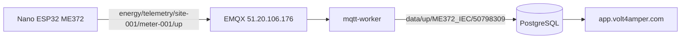

# ME372 → Volt4Amper köprüsü

Iskra ME372 optik okuyucu (meter-bridge / Arduino Nano ESP32) verisini
[app.volt4amper.com](https://app.volt4amper.com/) panelinde göstermek için mqtt-worker
otomatik çeviri yapar.

## Akış



ESP32 firmware **değiştirilmez** — aynı topic ve JSON envelope kalır.

## Worker ne yapar?

1. `energy/telemetry/+/+/up` topic'ine abone olur
2. Envelope içindeki `data.meter_id` → cihaz SN (ör. `50798309`)
3. `active_import_kwh` → Acrel `reported.EPI`
4. `pmax_import_kw` → `reported.MEPIMD`
5. Reaktif enerji → `reported.EQI` / `reported.EQE`
6. Sonuç `data/up/ME372_IEC/<meter_id>` olarak işlenir (mevcut ingest pipeline)

## Üretim deploy

1. `energy-mqtt-platform` kodunu sunucuya al
2. `.env.production` içinde (zaten var):
   - `MQTT_HOST=51.20.106.176`
   - `MQTT_USERNAME` / `MQTT_PASSWORD` (worker hesabı)
3. İsteğe bağlı: `ME372_PRODUCT_KEY=ME372_IEC` (varsayılan)
4. Worker'ı yeniden başlat:
   ```bash
   docker compose --env-file .env.production -f docker-compose.prod.yml up -d --build mqtt-worker
   ```

## Panelde sayaç kaydı

Panel → **Sayaç ekle** (admin):

| Alan | Değer |
|------|--------|
| SN | `50798309` (sayaçtan gelen `meter_id`) |
| Etiket | örn. `ME372 Optik — Saha` |
| Model | `Iskra ME372` |
| İzleme tipi | Tüketim |

`DEVICE_WHITELIST_ENABLED=true` ise kayıt zorunlu; `false` ise ilk MQTT mesajında otomatik görünür.

## Yerel test

```powershell
cd c:\projeler\energy-mqtt-platform
corepack pnpm --filter @communication/mqtt build
corepack pnpm --filter mqtt-worker test

# Worker + Postgres (lokal)
docker compose up -d postgres
corepack pnpm --filter @communication/db migrate
corepack pnpm --filter mqtt-worker dev
```

Örnek ME372 envelope publish (broker'a):

```powershell
corepack pnpm --filter mqtt-worker publish:test:me372
```

## meter-bridge tarafı (değişiklik yok)

`arduino/nano_esp32/me372_mqtt_bridge/config.h`:

- `MQTT_TOPIC_BASE` = `energy/telemetry`
- `MQTT_SITE_ID` = `site-001`
- `MQTT_DEVICE_ID` = `meter-001`

Broker: `51.20.106.176:1883` — Volt4Amper ile aynı EMQX.

## Sorun giderme

| Belirti | Kontrol |
|---------|---------|
| Panelde veri yok | Worker log: `me372_bridge_translated` |
| SN yanlış | `data.meter_id` sayaç numarası mı? |
| EPI boş | `active_import_kwh` envelope'da var mı? |
| Quarantine | Panelden SN kaydı / whitelist |

Log örneği:

```
[me372_bridge_translated] fromTopic=energy/telemetry/site-001/meter-001/up toTopic=data/up/ME372_IEC/50798309 meterId=50798309
```
